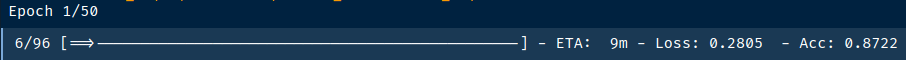

## ResNext model fine tuning

#### What is the influence of the dataloader `batch_size` on your CPU ?

> Increasing the batch_size increase the CPU level and the memory level, and decrease the ETA for one epoch

CPU level :  higher is better

Memory level :  higher is better up to a certain point...

Batch size of 3 :

Batch size of 30 :

#### What do we try to optimize with batch size ?

get the most of out accelerators. I.e.
- try to fill all CPU cores
- try to feed all memory without swap
- try to fill all GPU memory and compute %

#### What is your ETA with optimal batch_size for one epoch ?

This is your local response. 

#### What is the optimal accelerator for your setup ?

This is your local response. 
